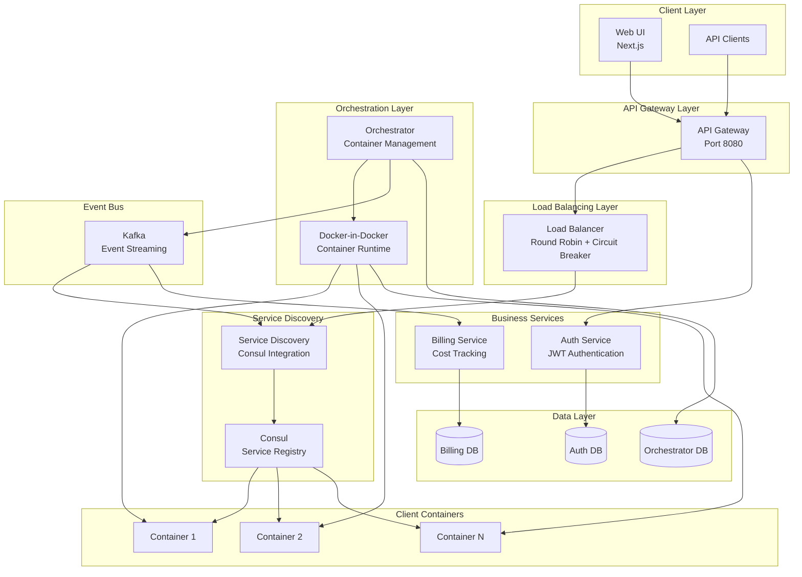

# NVIDIA Cloud Platform

A production-ready cloud platform that enables users to deploy containerized applications with automatic load balancing, service discovery, and billing. Built with microservices architecture, event-driven communication, and modern DevOps practices.

_Last updated: **December 2024**_

## 🚀 Overview

A cloud platform for deploying and managing containerized web applications. Users can upload Docker images, spawn multiple container instances, and have traffic automatically routed through an intelligent load balancing system.

**Key Features:**
- 🐳 Container lifecycle management
- ⚖️ Load balancing with round-robin distribution
- 🔍 Service discovery with Consul
- 💰 Real-time billing and cost tracking
- 🔐 JWT-based authentication
- 🚦 Circuit breaker pattern for resilience

## 🧩 Services

| Service | Description |
| --- | --- |
| `ui` | Next.js dashboard for images, containers, and auth flows |
| `api-gateway` | Public entrypoint, forwards requests to the Load Balancer |
| `auth-service` | FastAPI service with automatic default user seeding |
| `orchestrator` | Builds images, creates/stops containers, emits Kafka events |
| `service-discovery` | Consul watcher + cache, exposes `/services/healthy` |
| `load-balancer` | FastAPI service that routes by `website_url` using Service Discovery |
| `billing-service` | Cost calculation & reporting |
| `client-workload` | Synthetic traffic generator |

Supporting infrastructure: PostgreSQL, Kafka, Zookeeper, Consul, Docker-in-Docker.

## 🏗️ Architecture

### System Architecture Diagram



### Architecture Highlights

- **Service Discovery**: Consul Watch API maintains an in-memory cache of healthy containers indexed by `image_id` and `website_url`
- **Load Balancer**: Uses Round Robin selection with Circuit Breaker and fallback cache for resilience
- **Event-driven**: Orchestrator publishes container lifecycle events to Kafka; Service Discovery and Billing consume them
- **Authentication**: Default user auto-created on startup (`example@gmail.com` / `example123`)

## ✨ Key Features

- URL-based routing with normalization
- Auto-healing: Service Discovery registers containers with Consul health checks
- Circuit Breaker: Opens after 3 failures, retries after 15s, with 10s fallback cache
- Structured logging with correlation IDs


## 🛠️ Quick Start

### Prerequisites
- Docker 24+ and Docker Compose V2

### Installation
```bash
git clone <repo>
cd nvidia-project
cp .env.example .env
docker compose up -d --build
```

### Default Credentials
- Email: `example@gmail.com`
- Password: `example123`

### Service Endpoints
| Service | URL | Description |
| --- | --- | --- |
| UI | http://localhost:3000 | Web dashboard for managing images and containers |
| API Gateway | http://localhost:8080 | Public entry point for all API requests |
| Load Balancer | http://localhost:3004 | Internal load balancing service |
| Service Discovery | http://localhost:3006 | Service registry and health monitoring |
| Orchestrator | http://localhost:3003 | Container lifecycle management API |
| Billing | http://localhost:3007 | Billing and cost tracking API |
| Client Workload | http://localhost:3008 | Synthetic traffic generator API |
| Kafka UI | http://localhost:8081 | Kafka message broker UI |
| Consul UI | http://localhost:8500 | Consul service discovery UI |

## 🛠️ Technologies Used

### Backend
- **Python 3.11** - Main backend language
- **FastAPI** - Modern async web framework
- **PostgreSQL** - Relational database (3 instances)
- **Kafka** - Event streaming and message queue
- **Consul** - Service discovery and health monitoring
- **Docker-in-Docker** - Container runtime

### Frontend
- **Next.js 14** - React framework with App Router
- **TypeScript** - Type-safe JavaScript
- **Tailwind CSS** - Utility-first CSS framework

### Infrastructure
- **Docker & Docker Compose** - Containerization and orchestration
- **Zookeeper** - Kafka coordination
- **Kafka UI** - Kafka management interface

## 📋 Project Structure

```
nvidia-project/
├── services/
│   ├── ui/                    # Next.js frontend application
│   ├── api-gateway/           # Single entry point for all requests
│   ├── auth-service/          # Authentication and user management
│   ├── orchestrator/          # Container lifecycle management
│   ├── load-balancer/         # Traffic distribution and routing
│   ├── service-discovery/     # Consul integration and service registry
│   ├── billing/               # Cost calculation and reporting
│   └── client-workload/       # Synthetic traffic generator
├── infrastructure/            # Database init scripts
├── monitoring/                # Prometheus and Grafana configs
├── scripts/                   # Utility scripts (demo, health checks)
└── docker-compose.yml         # Service orchestration
```

### Access the UI
Open http://localhost:3000 and login with the default credentials above.

## 🧪 Testing

```bash
# Run tests for a specific service
cd services/load-balancer && pytest

# Run all tests
find services -name "test_*.py" -exec pytest {} \;
```

## 📖 Documentation

- [Architecture Documentation](docs/architecture.md) - Detailed system architecture
- [API Specifications](docs/api-specifications.md) - Complete API reference
- [Deployment Guide](docs/deployment-guide.md) - Production deployment instructions
- [Interview Preparation](INTERVIEW_PREPARATION.md) - Checklist for project presentation

## 🤝 Contribution

- Code style: `ruff` + `black` for Python
- Architecture: Async FastAPI patterns with lifespan managers
- Commits: Short messages (<72 chars), single-purpose commits

## 🎯 Key Features

### Load Balancing
- Round Robin distribution across healthy containers
- Circuit Breaker with fallback cache for resilience

### Service Discovery
- Consul integration with real-time health monitoring
- Watch API for instant container state updates

### Billing System
- Real-time cost calculation ($0.01 per minute per container)
- Event-driven processing from Kafka

## 🔒 Security

- JWT authentication with HttpOnly cookies
- Password hashing with bcrypt
- Input validation on all endpoints
- CORS configuration

## 📊 Monitoring

- Structured logging with correlation IDs
- Health check endpoints (`/health`) on all services
- Kafka UI: http://localhost:8081
- Consul UI: http://localhost:8500
- Logs stored in `./logs/<service>/app.log`

### Viewing Logs

```bash
# Use the log viewer script
./scripts/view-logs.sh auth-service

# Or use docker-compose
docker-compose logs -f <service-name>
```

## 🐛 Troubleshooting

### Services not starting
```bash
# Check service logs
docker-compose logs <service-name>

# Check service status
docker-compose ps

# Restart a specific service
docker-compose restart <service-name>
```

### Database connection issues
- Verify PostgreSQL containers are healthy: `docker-compose ps`
- Check environment variables in `.env` file
- Review database logs: `docker-compose logs orch-postgres`

### Kafka connection issues
- Ensure Zookeeper is running: `docker-compose ps zookeeper`
- Check Kafka logs: `docker-compose logs kafka`
- Verify Kafka UI is accessible: http://localhost:8081

---

**Built with ❤️ for the NVIDIA ScaleUp Hackathon**

For questions or issues, please open an issue in the repository.