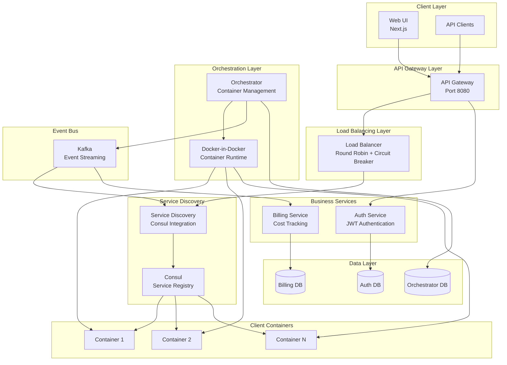

# NVIDIA Cloud Platform

A production-ready cloud platform that enables users to deploy containerized applications with automatic load balancing, service discovery, and billing. Built with microservices architecture, event-driven communication, and modern DevOps practices.

_Last updated: **December 2024**_

## 🚀 Overview

This platform provides a Kubernetes-alternative solution for deploying and managing containerized web applications. Users can upload Docker images, spawn multiple container instances, and have traffic automatically routed through an intelligent load balancing system. The platform includes real-time billing, service discovery, health monitoring, and a modern web dashboard.

**Key Capabilities:**
- 🐳 Container lifecycle management (create, start, stop, delete)
- ⚖️ Intelligent load balancing with round-robin distribution
- 🔍 Service discovery with Consul integration
- 💰 Real-time billing and cost tracking
- 🔐 JWT-based authentication and authorization
- 📊 Health monitoring and auto-healing
- 🚦 Circuit breaker pattern for resilience
- 📈 Synthetic workload generation for testing

## 🧩 Services & Status

| Service | Description | Status |
| --- | --- | --- |
| `ui` | Next.js dashboard for images, containers, and auth flows | ✅ |
| `api-gateway` | Public entrypoint, forwards requests to the Load Balancer | ✅ |
| `auth-service` | FastAPI service with automatic default user seeding | ✅ |
| `orchestrator` | Builds images, creates/stops containers, emits Kafka events | ✅ |
| `service-discovery` | Consul watcher + cache, exposes `/services/healthy` | ✅ |
| `load-balancer` | FastAPI service that routes by `website_url` using Service Discovery | ✅ |
| `billing-service` | Cost calculation & reporting | ✅ |
| `client-workload` | Synthetic traffic generator | ✅ |

Supporting infrastructure: PostgreSQL, Kafka, Zookeeper, Consul, Docker-in-Docker.

## 🏗️ Architecture

### System Architecture Diagram



### Architecture Highlights

- **Service Discovery as source of truth**: Consul Watch API feeds an in-memory cache (`ServiceCache`) that indexes healthy containers by `image_id` and `website_url`.
- **Load Balancer integration**: Uses an async `ServiceDiscoveryClient`, Round Robin selector, and Circuit Breaker with fallback cache to keep routing even if Service Discovery is temporarily down.
- **Event-driven orchestration**: Orchestrator publishes container lifecycle events to Kafka; Service Discovery and Billing consume them for real-time updates.
- **Authentication**: `auth-service` seeds a default user (`example@gmail.com` / `example123`) on startup if the database is empty.

## ✨ Key Features

- URL-based routing with normalization (protocol stripping, lowercase, trailing slash removal).
- Auto-healing registration: Service Discovery registers containers with Consul, including host TCP health checks through `docker-dind`.
- Load Balancer resilience:
  - Circuit Breaker opens after 3 consecutive Service Discovery failures.
  - Half-open retry after 15s, auto-close on success.
  - Fallback cache keeps the last successful response per `website_url` for 10s.
- Structured logging with correlation IDs across services.

## 🧪 Manual Validation Recipes

1. **Standard routing**
   ```bash
   docker exec nvidia-load-balancer curl -s -X POST http://localhost:3004/route \
     -H "Content-Type: application/json" \
     -d '{"website_url":"https://youtube.com"}'
   ```

2. **Circuit Breaker & fallback cache**
   ```bash
   # Warm the cache
   docker exec nvidia-load-balancer curl -s -X POST http://localhost:3004/route \
     -H "Content-Type: application/json" -d '{"website_url":"https://youtube.com"}'

   # Stop Service Discovery and send multiple requests
   docker-compose stop service-discovery
   for i in {1..4}; do
     docker exec nvidia-load-balancer curl -s -X POST http://localhost:3004/route \
       -H "Content-Type: application/json" -d '{"website_url":"https://youtube.com"}'
   done

   # Restart Service Discovery to observe HALF_OPEN → CLOSED transition
   docker-compose start service-discovery
   ```

3. **Service Discovery cache inspection**
   ```bash
   docker exec nvidia-service-discovery curl -s http://localhost:3006/services/cache/status | jq
   docker exec nvidia-service-discovery curl -s \
     "http://localhost:3006/services/healthy?website_url=https://youtube.com" | jq
   ```

## 🛠️ Development

### Prerequisites
- Docker 24+
- Docker Compose V2
- Python 3.11 (for local service runs)

### Quick start
```bash
git clone <repo>
cd nvidia-project

cp .env.example .env
docker compose up -d --build

docker compose ps            # verify services
docker compose logs -f load-balancer
```

### Default credentials
- UI/Auth default user is auto-created if the `users` table is empty:
  - Email: `example@gmail.com`
  - Password: `example123`

### Service Endpoints
| Service | URL | Description |
| --- | --- | --- |
| UI | http://localhost:3000 | Web dashboard for managing images and containers |
| API Gateway | http://localhost:8080 | Public entry point for all API requests |
| Load Balancer | http://localhost:3004 | Internal load balancing service |
| Service Discovery | http://localhost:3006 | Service registry and health monitoring |
| Orchestrator | http://localhost:3003 | Container lifecycle management API |
| Billing | http://localhost:3007 | Billing and cost tracking API |
| Client Workload | http://localhost:3008 | Synthetic traffic generator API |
| Kafka UI | http://localhost:8081 | Kafka message broker UI |
| Consul UI | http://localhost:8500 | Consul service discovery UI |

## 🛠️ Technologies Used

### Backend
- **Python 3.11** - Main backend language
- **FastAPI** - Modern async web framework
- **PostgreSQL** - Relational database (3 instances)
- **Kafka** - Event streaming and message queue
- **Consul** - Service discovery and health monitoring
- **Docker-in-Docker** - Container runtime

### Frontend
- **Next.js 14** - React framework with App Router
- **TypeScript** - Type-safe JavaScript
- **Tailwind CSS** - Utility-first CSS framework

### Infrastructure
- **Docker & Docker Compose** - Containerization and orchestration
- **Zookeeper** - Kafka coordination
- **Kafka UI** - Kafka management interface

## 📋 Project Structure

```
nvidia-project/
├── services/
│   ├── ui/                    # Next.js frontend application
│   ├── api-gateway/           # Single entry point for all requests
│   ├── auth-service/          # Authentication and user management
│   ├── orchestrator/          # Container lifecycle management
│   ├── load-balancer/         # Traffic distribution and routing
│   ├── service-discovery/     # Consul integration and service registry
│   ├── billing/               # Cost calculation and reporting
│   └── client-workload/       # Synthetic traffic generator
├── infrastructure/            # Database init scripts
├── monitoring/                # Prometheus and Grafana configs
├── scripts/                   # Utility scripts (demo, health checks)
└── docker-compose.yml         # Service orchestration
```

## 🚀 Quick Start Guide

### Prerequisites
- Docker 24+ and Docker Compose V2
- Git
- 8GB+ RAM recommended

### Installation

1. **Clone the repository**
   ```bash
   git clone <repository-url>
   cd nvidia-project
   ```

2. **Set up environment variables**
   ```bash
   cp .env.example .env
   # Edit .env with your configuration (optional for development)
   ```

3. **Start all services**
   ```bash
   docker-compose up -d --build
   ```

4. **Verify services are running**
   ```bash
   docker-compose ps
   # Or use the health check script
   ./scripts/check-services.sh
   ```

5. **Access the UI**
   - Open http://localhost:3000 in your browser
   - Login with default credentials:
     - Email: `example@gmail.com`
     - Password: `example123`

### Running the Demo

Use the provided demo script to see the complete flow:

```bash
./scripts/demo.sh
```

This script will:
- Start all services
- Wait for services to be healthy
- Display service URLs and credentials
- Provide step-by-step demo instructions

## 🧪 Testing

### Manual Testing

The project includes several manual validation recipes (see "Manual Validation Recipes" section above) for testing:
- Standard routing functionality
- Circuit Breaker and fallback cache behavior
- Service Discovery cache inspection

### Running Tests

```bash
# Run tests for a specific service
cd services/load-balancer
pytest

# Run all tests
find services -name "test_*.py" -exec pytest {} \;
```

### Testing Roadmap
- ✅ Unit tests for `CircuitBreaker`, `FallbackCache`, and service selection
- ✅ Integration tests for Service Discovery cache updates + Load Balancer routing
- 🔄 End-to-end tests for complete flows (auth → image → container → route)

## 📖 Documentation

- [Architecture Documentation](docs/architecture.md) - Detailed system architecture
- [API Specifications](docs/api-specifications.md) - Complete API reference
- [Deployment Guide](docs/deployment-guide.md) - Production deployment instructions
- [Interview Preparation](INTERVIEW_PREPARATION.md) - Checklist for project presentation

## 🤝 Contribution Guidelines

- **Code Style**: Python services follow `ruff` + `black` formatting
- **Architecture**: Prefer async FastAPI patterns (lifespan managers for background tasks)
- **Language**: All documentation and comments must be in **English**
- **Commits**: Use short commit messages (<72 chars) and favor single-purpose commits
- **Testing**: Add tests for new features and ensure existing tests pass

## 🎯 Key Features Explained

### Load Balancing
- **Round Robin**: Distributes requests evenly across healthy containers
- **Circuit Breaker**: Prevents cascading failures when downstream services are unavailable
- **Fallback Cache**: Maintains last known good routing information for 10 seconds

### Service Discovery
- **Consul Integration**: Real-time service registration and health monitoring
- **Watch API**: Long-polling for instant updates on container state changes
- **Health Checks**: TCP health checks every 10 seconds via Docker-in-Docker

### Billing System
- **Real-time Calculation**: Estimates costs for active containers on-demand
- **Event-driven**: Processes container lifecycle events from Kafka
- **Per-container Granularity**: Tracks usage at individual container level
- **Fixed Rate**: $0.01 per minute per container

### Event-Driven Architecture
- **Kafka Topics**: `container-lifecycle` for all container events
- **Event Types**: `container.created`, `container.started`, `container.stopped`, `container.deleted`
- **Consumers**: Service Discovery and Billing services consume events asynchronously

## 🔒 Security Considerations

- JWT tokens for authentication with configurable expiration
- Password hashing using bcrypt
- Input validation on all API endpoints
- CORS configuration for cross-origin requests
- Environment variables for sensitive configuration

## 📊 Monitoring & Observability

- Structured logging with correlation IDs across services
- Health check endpoints on all services (`/health`)
- Kafka UI for event monitoring (http://localhost:8081)
- Consul UI for service discovery visualization (http://localhost:8500)
- Metrics endpoints for service statistics

## 🐛 Troubleshooting

### Services not starting
```bash
# Check service logs
docker-compose logs <service-name>

# Check service status
docker-compose ps

# Restart a specific service
docker-compose restart <service-name>
```

### Database connection issues
- Verify PostgreSQL containers are healthy: `docker-compose ps`
- Check environment variables in `.env` file
- Review database logs: `docker-compose logs orch-postgres`

### Kafka connection issues
- Ensure Zookeeper is running: `docker-compose ps zookeeper`
- Check Kafka logs: `docker-compose logs kafka`
- Verify Kafka UI is accessible: http://localhost:8081

---

**Built with ❤️ for the NVIDIA ScaleUp Hackathon**

For questions or issues, please open an issue in the repository.